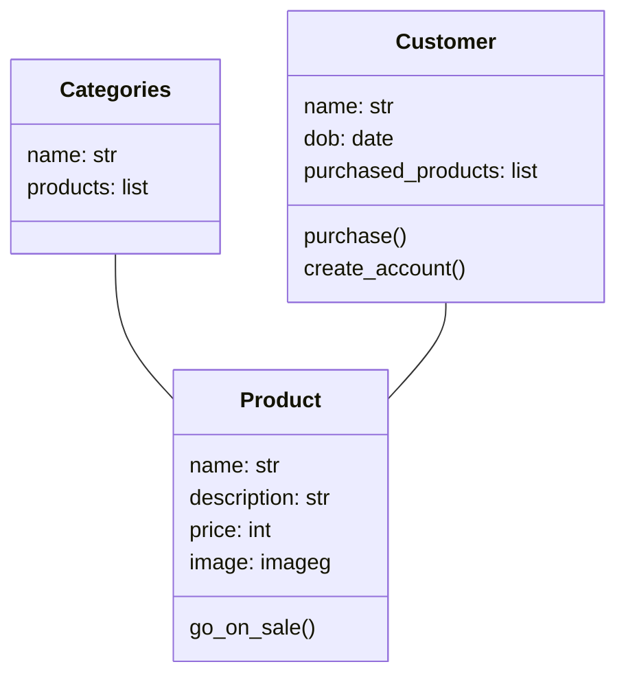
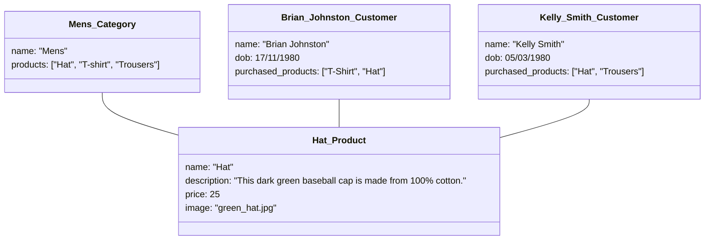

# E-Commerce Store
These diagrams represents a basic e-commerce store.

## A.D.2

> In this example of a basic E-Commerce clothing site layout, we have a set of categories (for example, Mens, Women, Children, Sports). Each of these categories would have a list of products. These products have a name, description, price and image to display on the site, and a method to call when the item is on sale. Separately, there is a customer class that also has a list of products, specifically ones the customer has purchased in the past. They have a method to create their account, and purchase more products.

## A.D.3

Note: Normally in object diagrams the Title would be as shown below. Due to the way I have built this diagram (Mermaid Markdown in VSCode), I have had to add underscores, and the diagram breaks when given a colon. The correct titles for each section would be as follows:
* Mens: Category
* Brian Johnston: Customer
* Kelly Smith: Customer
* Hat: Product

> In this example of a basic E-Commerce clothing site object diagram, we have the category Hat (of type product). This is linked to both the category of Mens (as one of the products under this category), and linked to the customer Brian Johnston (as one of the products Brian Johnston has purchased previously). Another customer named Kelly Smith has also purchased the hat, therefore those are also linked.