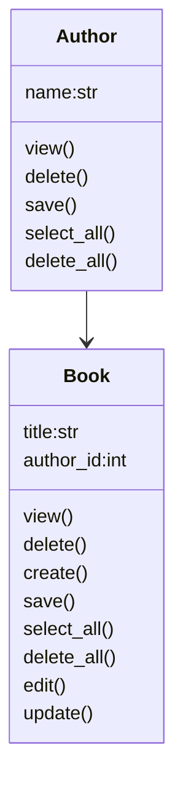

```mermaid
classDiagram

class Book {
    title:str
    author_id:int
    view()
    delete()
    create()
    save()
    select_all()
    delete_all()
    edit()
    update()
}

class Author {
    name:str
    view()
    delete()
    save()
    select_all()
    delete_all()
}

Author --> Book
```